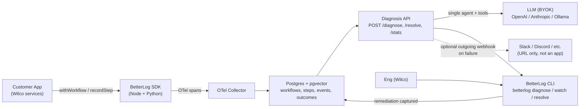

# BetterLog — MVP Specification

**Status:** Pre-MVP. Planning artifact, not implementation guide.
**Owner:** Tanishq
**Design partner:** Wilco (farmstore-modern)
**Target build window:** 6 weeks from kickoff
**Last updated:** 2026-05-23

---

## 1. Hypothesis

> **Given workflow-annotated traces from a customer's distributed system, a single LLM-backed diagnosis agent can answer "what happened to X?" faster and more accurately than an engineer reading logs across services.**

### Falsification criteria

The hypothesis is **falsified** if any of the following hold after 6 weeks of MVP work with Wilco:

- AI diagnosis is correct on fewer than 80% of replayed historical incidents.
- Median time-to-answer exceeds 60 seconds.
- Wilco's eng team uses the CLI fewer than 3 times per week unprompted.
- Adding a second workflow (e.g., refunds, inventory sync) requires changes to the core data model.

If any of those fail, the product hypothesis is wrong as currently framed and needs to be re-examined before adding more surface area.

---

## 2. Problem framing

Enterprises run on workflows that span many systems. Today, when one of these workflows fails, diagnosing it is expensive human labor — typically a customer support agent pinging an operations person, who pings an engineer, who tails logs across several services to reconstruct what happened. That coordination work is the largest tractable target for agentic-AI software spend (per the Bain "agentic AI and SaaS" thesis).

Existing observability tools (Datadog, Sentry, Grafana, etc.) capture spans, logs, and metrics but operate at the **technical** level — they tell you *which service returned a 500*, not *why this specific business workflow didn't complete and what to do about it*.

BetterLog targets the seam between these tools and business outcomes: a thin layer that understands workflows as first-class objects, observes them end-to-end, and answers natural-language diagnostic questions about them.

### Anchoring use case: Wilco order fulfillment

A single Wilco order traverses (at minimum) these systems:

```
ecom-nuxt -> ecom-middleware -> medusa (ecom-backend)
          -> omniapi-tasks (rabbitmq consumer)
          -> omniapi-integrator (payload transform)
          -> omniapi-services -> back40 (OMS/ERP)
          -> epicor (final system of record)
```

Failures can happen at any boundary. Async boundaries (RabbitMQ) make this especially hard with traditional tracing. This is the MVP's primary test bed.

---

## 3. Data model

This is the most important section. Every other architectural decision flows from these definitions.

### Conceptual model

- **Workflow** — a named business process with a known start trigger, intermediate steps, and a terminal outcome. Identified by a stable `workflow_id` and one or more `business_keys` (e.g., `order_id: "1234"`).
- **Step** — a discrete unit of work within a workflow, with structured input/output and a status. Steps may run on any service.
- **Event** — anything noteworthy that happens during a workflow that isn't a step (state changes, external API calls, queue messages, retries). Tagged with the workflow context.
- **Outcome** — the terminal event for a workflow. One of `success | failed | timeout | escalated | cancelled`, with a reason code and optional remediation taken.
- **Business key** — a customer-meaningful identifier (order ID, invoice ID, customer ID) attached to a workflow so humans can ask about it later. By convention, also include a numeric outcome field when one is available (e.g., `order_value_cents`). It's stored as a string like any other business key, but lets us report business impact later ("$X of broken-order GMV last week") without backfilling historical data.

### TypeScript-style schema (SDK surface)

```typescript
type WorkflowStatus = "running" | "success" | "failed" | "timeout" | "escalated" | "cancelled";
type StepStatus = "started" | "success" | "failed" | "skipped" | "retrying";

interface Workflow {
  id: string;                          // ulid, generated server-side or client-side
  name: string;                        // e.g. "order.fulfillment"
  version: string;                     // semver, customer-controlled
  environment: string;                 // "production", "staging", etc. (just a tag)
  business_keys: Record<string, string>; // { order_id: "1234", order_value_cents: "8900", customer_id: "c-99" }
  status: WorkflowStatus;
  started_at: string;                  // ISO 8601
  ended_at?: string;
  trace_id: string;                    // OTel trace_id for correlation
  metadata?: Record<string, unknown>;
}

interface Step {
  id: string;
  workflow_id: string;
  name: string;                        // e.g. "back40.push"
  service: string;                     // e.g. "omniapi-services"
  status: StepStatus;
  started_at: string;
  ended_at?: string;
  input?: unknown;                     // allow-listed payload snapshot
  output?: unknown;                    // allow-listed payload snapshot
  error?: { message: string; code?: string; stack?: string };
  span_id: string;                     // OTel span_id
  parent_step_id?: string;
}

interface Event {
  id: string;
  workflow_id: string;
  step_id?: string;
  type: string;                        // "queue.published", "external.api.called", etc.
  service: string;
  timestamp: string;
  data?: Record<string, unknown>;
}

interface Outcome {
  workflow_id: string;
  status: Exclude<WorkflowStatus, "running">;
  reason_code?: string;                // machine-friendly: "integrator_payload_invalid"
  reason_text?: string;                // human-friendly
  remediation_taken?: string;          // captured later when a human resolves the issue
  resolved_at?: string;
  resolved_by?: string;
}
```

### Postgres-style DDL (storage layer)

```sql
CREATE TABLE workflows (
  id            TEXT PRIMARY KEY,
  name          TEXT NOT NULL,
  version       TEXT NOT NULL,
  environment   TEXT NOT NULL,
  business_keys JSONB NOT NULL,
  status        TEXT NOT NULL,
  started_at    TIMESTAMPTZ NOT NULL,
  ended_at      TIMESTAMPTZ,
  trace_id      TEXT NOT NULL,
  metadata      JSONB
);
CREATE INDEX idx_workflows_name_started ON workflows (name, started_at DESC);
CREATE INDEX idx_workflows_business_keys ON workflows USING GIN (business_keys);
CREATE INDEX idx_workflows_status_started ON workflows (status, started_at DESC);

CREATE TABLE steps (
  id              TEXT PRIMARY KEY,
  workflow_id     TEXT NOT NULL REFERENCES workflows(id),
  name            TEXT NOT NULL,
  service         TEXT NOT NULL,
  status          TEXT NOT NULL,
  started_at      TIMESTAMPTZ NOT NULL,
  ended_at        TIMESTAMPTZ,
  input           JSONB,
  output          JSONB,
  error           JSONB,
  span_id         TEXT NOT NULL,
  parent_step_id  TEXT
);
CREATE INDEX idx_steps_workflow ON steps (workflow_id, started_at);
CREATE INDEX idx_steps_status ON steps (status, started_at DESC) WHERE status = 'failed';

CREATE TABLE events (
  id           TEXT PRIMARY KEY,
  workflow_id  TEXT NOT NULL REFERENCES workflows(id),
  step_id      TEXT REFERENCES steps(id),
  type         TEXT NOT NULL,
  service      TEXT NOT NULL,
  timestamp    TIMESTAMPTZ NOT NULL,
  data         JSONB
);
CREATE INDEX idx_events_workflow_ts ON events (workflow_id, timestamp);

CREATE TABLE outcomes (
  workflow_id        TEXT PRIMARY KEY REFERENCES workflows(id),
  status             TEXT NOT NULL,
  reason_code        TEXT,
  reason_text        TEXT,
  remediation_taken  TEXT,
  resolved_at        TIMESTAMPTZ,
  resolved_by        TEXT
);

-- pgvector for similarity search over failure signatures
CREATE EXTENSION IF NOT EXISTS vector;
CREATE TABLE failure_embeddings (
  workflow_id TEXT PRIMARY KEY REFERENCES workflows(id),
  embedding   VECTOR(1536),
  summary     TEXT NOT NULL
);
CREATE INDEX idx_failure_embeddings_hnsw ON failure_embeddings USING hnsw (embedding vector_cosine_ops);
```

### OpenTelemetry mapping

We do **not** invent a new instrumentation standard. Workflow/step/event records are derived from OTel spans with conventional attributes:

| Span attribute            | Maps to                              |
|---------------------------|---------------------------------------|
| `betterlog.workflow.id`   | `Workflow.id`                         |
| `betterlog.workflow.name` | `Workflow.name`                       |
| `betterlog.business.*`    | `Workflow.business_keys`              |
| `betterlog.step.name`     | `Step.name`                           |
| `betterlog.step.status`   | `Step.status`                         |
| `betterlog.event.type`    | `Event.type`                          |
| `betterlog.outcome.status`| `Outcome.status`                      |
| `betterlog.outcome.reason`| `Outcome.reason_code`                 |

Customers already using OTel can adopt by adding attributes; customers without OTel use the thin SDK which emits these attributes for them.

---

## 4. Example questions (eval suite v0)

These are the 10 questions the MVP must be able to answer well. They form the v0 evaluation suite. Sample "good answers" are illustrative; real answers will be data-driven.

> **Note on assumptions:** Wilco-specific details below (queue names, service errors, business key conventions) are best-guesses based on the stack described. Each `[ASSUMPTION]` tag flags something to validate with the actual Wilco system before the eval suite is final.

### Q1. "What happened to order #1234?"

The single most important question. The MVP must answer this well or nothing else matters.

**Good answer:**
> Order `#1234` (workflow `order.fulfillment` started 2:14 PM) **failed at step `back40.push` at 2:17 PM**.
> Root cause: `omniapi-integrator` rejected the payload with `SKU_MAPPING_MISSING` for product `P-9821`. [ASSUMPTION: this is a real Wilco error code]
> Evidence: [trace link], step input/output snapshot.
> Similar failures: 3 in the last 24 hours, all involving SKU `P-9821`.
> Suggested next step: add `P-9821` to the SKU mapping table, then replay this workflow.

### Q2. "Why are orders failing at the integrator today?"

A pattern question, not an individual lookup.

**Good answer:**
> 47 `order.fulfillment` workflows failed at step `integrator.transform` today (vs. baseline of 2/day).
> 38 of 47 share the same `reason_code: SKU_MAPPING_MISSING`.
> Affected SKUs: `P-9821` (31), `P-7432` (4), `P-0019` (3).
> First failure: 1:47 PM. Possible trigger: deploy of `omniapi-integrator` at 1:42 PM. [ASSUMPTION: deploy correlation requires CI integration]
> Suggested next step: review integrator change since 1:42 PM, or rollback.

### Q3. "Show me orders stuck between Medusa and back40 in the last hour."

A status query, not a diagnosis.

**Good answer:**
> 12 `order.fulfillment` workflows are stuck (started > 5 min ago, last step is `queue.published` to `omniapi-tasks`, no `back40.push` yet). [ASSUMPTION: "stuck" threshold is configurable, 5 min is placeholder]
> List: [`#1201`, `#1207`, `#1209`, ...]
> Common pattern: all 12 are missing the consumer acknowledgement event from `omniapi-tasks`.
> Likely cause: `omniapi-tasks` pod restart at 2:51 PM dropped in-flight messages.
> Suggested next step: check `omniapi-tasks` pod health, replay the 12 affected workflows.

### Q4. "Has this kind of failure happened before?"

Asked as a follow-up after seeing a specific failure.

**Good answer:**
> Yes. `SKU_MAPPING_MISSING` failures for product `P-9821` occurred on:
> - 2026-05-09 (4 failures, resolved by manual SKU sync)
> - 2026-04-22 (1 failure, resolved by adding mapping)
> - 2026-04-03 (8 failures, resolved by reseeding catalog)
> The most recent resolution (2026-05-09) used a manual SKU sync script — same approach may apply here.

### Q5. "Is the order pipeline healthy right now?"

A high-level health check, suitable for a `betterlog health` CLI invocation.

**Good answer:**
> Order fulfillment pipeline: **DEGRADED**.
> Last 1 hour: 142 workflows started, 89 succeeded, 47 failed, 6 still running.
> Failure rate: 33% (baseline: 1.4%).
> Dominant failure mode: `SKU_MAPPING_MISSING` at `integrator.transform` (38 of 47).
> Other pipelines (`refund.processing`, `inventory.sync`): nominal. [ASSUMPTION: these workflows exist in Wilco]

### Q6. "When did this order's customer last contact us, and is there a related ticket?"

Cross-system correlation, beyond just internal services.

**Good answer:**
> Order `#1234` belongs to customer `c-99`. [ASSUMPTION: Wilco has a CRM integration accessible to BetterLog]
> Most recent support ticket: `T-5512` (opened 2:31 PM, 14 min after order failure).
> Ticket subject: "My order didn't go through" — likely related.
> No prior tickets from this customer in the last 30 days.

### Q7. "Did the deploy at 1:42 PM cause the spike in failures?"

A causal question, requires correlation with external events.

**Good answer:**
> Strong correlation. [ASSUMPTION: deploy events are ingested]
> - Before 1:42 PM: `order.fulfillment` failure rate was 1.2% (3 of 240 in prior hour).
> - After 1:42 PM: failure rate jumped to 33%.
> - The deploy affected `omniapi-integrator` (the service where the failures occur).
> - All 47 post-deploy failures use a code path that was modified in the deploy.
> Recommendation: rollback `omniapi-integrator` to the previous version while investigating.

### Q8. "What's the average time from order placement to back40 confirmation?"

A latency question. Useful for SLA monitoring.

**Good answer:**
> Over the last 24 hours: median 4.2s, p95 11.8s, p99 47.3s.
> Compared to the previous 7 days: median 3.9s (+8%), p99 12.1s (+290% — likely caused by today's failures triggering retries).
> Slowest step on average: `back40.push` (median 2.1s).

### Q9. "Which step is failing most often this week?"

A trend question. Useful for weekly ops reviews.

**Good answer:**
> Top 5 failing steps (last 7 days):
> 1. `integrator.transform` — 89 failures (mostly today)
> 2. `back40.push` — 14 failures (intermittent, network timeouts) [ASSUMPTION]
> 3. `medusa.create_order` — 3 failures (payment rejections)
> 4. `queue.published` — 1 failure
> 5. `epicor.sync` — 1 failure

### Q10. "I just fixed this. How do I tell BetterLog?"

The remediation-capture loop. Critical for building the data moat described in the long-term vision.

**Good answer (as a CLI interaction):**
```
$ betterlog diagnose order-1234
[diagnosis from Q1]

$ betterlog resolve order-1234 \
    --reason SKU_MAPPING_MISSING \
    --action "added SKU P-9821 to mapping table"

Recorded resolution against order-1234 (reason_code: SKU_MAPPING_MISSING).
30 other orders share this reason_code. Apply the same resolution to all of them? [y/N]
> y
Marking 30 workflows as resolved with the same action... done.
```
(MVP captures the resolution metadata; "replaying" the 30 workflows is the v2 remediation primitive deferred in Section 6.)

---

## 5. MVP architecture



### Component summary

| Component | Purpose | MVP scope |
|---|---|---|
| **SDK (Node + Python)** | Thin wrappers that emit OTel spans with `betterlog.*` attributes. Two languages because Wilco's stack is Node-heavy with some Python possible. | `withWorkflow(name, businessKeys, fn)` and `recordStep(name, status, data?)`. That's it. |
| **OTel Collector** | Standard OTel collector configured to forward spans with `betterlog.workflow.*` attributes to the ingestion endpoint. | Standard Docker deployment, single instance. |
| **Storage** | Postgres for relational data, pgvector extension for failure-signature similarity. Single instance, no HA. | Schema from Section 3. ClickHouse considered but deferred — Postgres is sufficient at MVP scale. |
| **Diagnosis API** | Single HTTP endpoint that takes a natural-language question, calls one LLM agent with a fixed set of query tools, returns a structured diagnosis. Also exposes `/resolve` and `/stats` endpoints consumed by the CLI. | `POST /diagnose`, `POST /resolve`, `GET /stats`. |
| **LLM (BYOK)** | Customer brings their own OpenAI / Anthropic / Ollama key. No managed inference at MVP. | Local Ollama fallback documented for trial. |
| **CLI** | The only user-facing surface. A thin HTTP client over the Diagnosis API, distributed as `@betterlog/cli` (npm). Engineers run it from their laptop or any shell. | Commands: `diagnose`, `health`, `stuck`, `similar`, `stats`, `watch`, `resolve`, `config`. API key from `BETTERLOG_API_KEY` env var or `~/.betterlog/config.json`. |
| **Outgoing webhook (optional)** | Single configurable URL that receives a POST when a workflow fails. Lets customers route alerts into Slack / Discord / PagerDuty / email-relay without us building a Slack app. | One URL per workspace, hardcoded for MVP. |

### Single-agent diagnosis loop

One agent, many tools. No multi-agent orchestration.

Tools provided to the agent (MVP set):
- `get_workflow(workflow_id)` — full workflow + all steps + all events.
- `find_workflow_by_business_key(key_name, key_value)` — e.g., `order_id` → workflow.
- `search_recent_failures(workflow_name, time_window)` — recent failed workflows of a type.
- `find_similar_failures(workflow_id, k=5)` — pgvector similarity over failure signatures.
- `get_step_payload(step_id)` — allow-listed input/output for a step.
- `get_pipeline_stats(workflow_name, time_window)` — counts of running/success/failed/timeout.

The agent decides which tools to call, when to stop, and what to conclude. Single-shot, no recursion or planning loops in MVP.

---

## 6. MVP scope — in and out

### In scope (build these)

- Node SDK with `withWorkflow` + `recordStep` (TypeScript).
- Python SDK with the same two primitives.
- OTel collector configuration.
- Postgres + pgvector schema.
- Ingestion service: OTel collector receiver → Postgres writer.
- Diagnosis API: `POST /diagnose` with single-agent + tools.
- CLI (`@betterlog/cli`): `diagnose`, `health`, `stuck`, `similar`, `stats`, `watch`, `resolve`, `config` commands.
- Outgoing webhook on workflow failure (single URL, POSTs structured payload — customer wires it to Slack incoming webhook / Discord / PagerDuty as they like).
- Instrumentation of one Wilco workflow (`order.fulfillment`) end-to-end.
- RabbitMQ trace context propagation (because the order flow demands it).
- Eval harness: replay 20+ historical Wilco incidents, measure accuracy.

### Out of scope (do NOT build)

- Web dashboard of any kind.
- React Flow (drag-drop or read-only DAG visualization).
- Multi-agent architecture / per-service agents / master coordinator.
- Authentication, sign-up, user accounts.
- Projects / workspaces / multi-tenancy.
- Environments / promotion flows between dev/stage/prod (environment is just a string tag on the SDK).
- Custom metrics, charts, time-series visualizations.
- Workflow definition UI, DSL, or no-code editor.
- Auto-discovery of workflows from un-annotated traces.
- Auto-remediation / agentic execution of fixes — **deferred to v2, not killed**. MVP is diagnosis-only, but the data model and SDK surface should not foreclose a future `replayWorkflow(id)` or scoped action primitive. The moment the diagnosis engine is trusted, "replay this stuck workflow" becomes the next obvious feature.
- Marketing site, landing page, pricing page.
- Onboarding flow / settings UI.
- License selection (deferred decision).
- Native Slack app / bot, email alerts, PagerDuty integration. (Single outgoing webhook covers the urgent case; first-class push surfaces come after the CLI proves the engine is useful.)
- Multi-tenancy, RBAC, SSO.
- Cross-customer pattern detection (single-customer MVP).

If a feature isn't required to answer the 10 questions in Section 4, it's not in MVP.

---

## 7. Success criteria

The MVP is **successful** if all of the following are true after 6 weeks:

- [ ] Wilco's eng team invokes the CLI at least **5 times per week** unprompted, across **≥2 distinct engineers**.
- [ ] AI diagnosis is correct on **≥80%** of the 20+ replayed historical incidents in the eval harness.
- [ ] Median time-to-answer for a `betterlog diagnose` invocation is **<30 seconds**.
- [ ] A **second workflow** (refund or inventory) is instrumented without changing the core data model.
- [ ] At least **one real production incident** at Wilco was resolved faster because of BetterLog, with a named owner who will say so on record.

If we hit 4 of 5, the MVP is a qualified success and we keep iterating. If we hit 2 of 5 or fewer, the hypothesis is wrong and we re-examine before adding scope.

---

## 8. Open questions

Things to validate with Wilco specifically. Each blocks or shapes part of the MVP.

1. **Business keys** — what's the canonical order identifier across Wilco's systems? Medusa order ID? back40 order ID? Both? How are they correlated?
2. **RabbitMQ propagation** — what message broker library is `omniapi-tasks` using? Does it already inject trace context into message headers, or do we need to add it manually?
3. **Service language coverage** — confirmed: ecom-middleware (NestJS), omniapi-* (NestJS), all Node. Is anything Python? Anything else?
4. **back40 instrumentability** — is back40 a system we can add SDK calls to, or is it third-party / closed?
5. **Existing observability** — does Wilco run Datadog/Sentry/OTel today? If yes, can we read from their existing collector or do we need to deploy our own?
6. **Payload sensitivity** — what PII lives in order payloads? We need an allow-list strategy before capturing any step input/output to storage.
7. **Deploy event source** — to answer Q7 (deploy correlation), we need access to deploy events. CI system? GitHub Actions? Kubernetes events?
8. **Historical incidents corpus** — do we have access to ~20 real incidents (Slack threads, postmortems, support tickets) that we can replay through the eval harness?
9. **CLI distribution to Wilco engineers** — internal npm registry, GitHub Packages, or just a tarball + install script? Where does the API key live on each engineer's machine? Is there a desire for a single shared key per team vs. per-engineer keys (for audit)?
10. **Definition of "stuck"** — Q3 mentions a 5-minute threshold. What's the real SLA for an order to reach back40?

These get resolved in week 0 (kickoff conversation with Wilco), not deferred.
